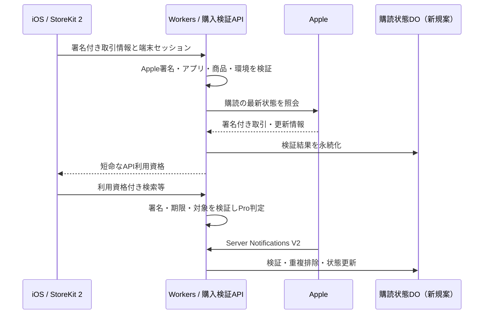

# App Store Server APIによるPro購入検証・実装企画書

作成日: 2026-09-09 / 状態: コード実装・ローカル検証済み。本番未反映、実購入検証待ち。

## 実装状況（2026-09-09追記・以下の当初案より優先）

- ユーザー承認により実装。自己申告Proはまだいないため案内・観測モードは不要との指示を反映し、旧ヘッダーを信用する切替設定は設けていない。
- Apple公式Nodeライブラリ3.1.0をリクエスト内で初期化し、Workers上の証明書チェーン、改ざん、別アプリ・別環境拒否、API JWT署名を確認。
- 新しいBillingDO、匿名セッション、15分の署名付き利用資格、購入検証・更新・V2通知、iOSの購入/復元/前面復帰同期を実装。
- App IDは6801570852、Family SharingとGrace Periodは無効（App Store Connect APIで確認）。Sandboxは全体100検索/グラフ要求/UTC日で提供し、共有Keepa費用を制限する。
- In-App Purchaseキー未設定。実際のSandbox購入・復元、Apple API照会権限、オンライン証明書確認、V2通知の配送、本番デプロイ、新iOSビルドの配布は未完了。
- 本番反映手順・保持期間・制限は [運用手順](docs/BILLING-OPERATIONS.md) を参照。実機確認まで本番へデプロイしない。

## 1. 目的と推奨方針

サーバーが `X-App-Plan: pro` の自己申告だけでPro機能を許可する状態を廃止する。Appleが署名したStoreKit 2の取引情報とApp Store Server APIの購読状態から、利用資格をサーバーで判定する。

推奨は「匿名利用を維持し、購入検証・通知・短命なAPI利用資格を段階導入する」。偽のPro申告を防ぐことを初期目標とし、購入証明そのもののコピーを完全に防げるとは約束しない。強い購入者識別にはアカウントや端末認証を含む別設計が必要。

本企画書の数値・API名・保存方式は実装案。実装開始、インフラ追加、本番切替は別途判断する。

## 2. 現状確認

| 対象 | 実装と課題 |
|---|---|
| `ios/BarcodeSedori/Sources/Store/EntitlementStore.swift` | StoreKit 2の `.verified` / `currentEntitlements` / `updates` を利用。端末側のApple署名検証は既にある |
| 同 `purchase()` | `product.purchase()` にappAccountTokenを指定していない。成功時は先に `finish()` して再評価 |
| 同 `restore()` | `AppStore.sync()` とcurrentEntitlementsで復元 |
| `ios/BarcodeSedori/Sources/API/APIClient.swift` | UserDefaultsのPro状態から `X-App-Plan` を送信 |
| `server/src/routes.js` | `isProRequest()` が上記ヘッダーを信用。Pro限定ルート、無料枠免除、Keepa優先度等へ波及 |
| サーバー基盤 | Cloudflare Workers + KV + Durable Objects。Apple購入状態の永続管理はない |
| 利用者識別 | アプリ独自アカウントなし。既存の `X-Device-Id` は自己申告値であり認証資格ではない |

「レシート検証」は便宜上の呼称。本案はStoreKit 2の署名付き取引情報（JWS）を中心とし、旧レシート検証方式の新規導入は行わない。

## 3. 対象範囲

- Pro月額商品 `jp.sellira.sellerlens.pro.monthly` と導入オファー。
- Bundle ID `jp.sellira.sellerlens`。数値App Apple IDは実装時にApp Store Connectで再確認する。
- 新規購入、更新、復元、機種変更、返金、失効、支払い失敗、猶予期間。
- Pro必須APIと無料枠免除判定の統一。Amazon連携だけで許可している機能の条件は維持する。
- Production / Sandbox / XcodeローカルStoreKitの分離、旧ビルドの移行。

対象外: 料金・無料体験日数の変更、Amazon OAuth変更、第三者課金サービス導入、初期段階でのログイン機能追加。端末だけで動く機能の改造耐性を保証するものではない。

## 4. 推奨構成（未構築）

Apple公式Nodeライブラリを第一候補とするが、Workers互換性は未検証。証明書チェーン検証、オンライン証明書確認、API署名、依存モジュールを実際のWorkersランタイムで検証する。Nodeテストやバンドル成功だけで互換と判断しない。非互換時は実装を止め、Node実行基盤の追加案と費用を提示する。署名検証を省略したり、独自の簡易検証へ置換したりしない。

## 5. 認証・購入紐づけ

### 初期方針

サーバー発行のランダムな端末セッション資格をKeychainへ保存する。端末IDだけではセッションを再発行しない。新規セッション作成は未認証入口としてレート制限する。購入検証後にそのセッションへ利用資格を発行する。

購入の主キーは `(environment, originalTransactionId)`。更新ごとのtransactionIdと分離する。新規購入時はサーバーが発行したUUIDを `appAccountToken` としてStoreKitへ渡す。これは相関用識別子であって、秘密鍵・パスワード・Apple IDの証明ではない。[資料2]

既存購入にはappAccountTokenがないため、不在だけで拒否しない。復元時はStoreKitから取得したJWSを再検証し、最新購読状態を照会する。同じ購入が複数端末で復元されることを許容する初期案とし、一端末固定や「最初の申告者が永久所有者」の方式は採用しない。既存紐づけを端末からの任意UUIDで上書きしない。

### 防げること・残る限界

- 防ぐ: `X-App-Plan`だけの偽装、改ざんJWS、他アプリ・別商品の購入、失効済み購入による継続利用。
- 単なるUUID照合では防げない: 有効な購入JWSを入手した第三者による復元申請。匿名方式では正当な別端末復元との完全な区別ができない。
- 短命トークンと端末セッションの照合は、セッションも含めてコピーされた場合の対策にはならない。
- App Attestは正規アプリ・端末由来のリクエスト確認を補強するが、Apple IDの所有者を証明するものではない。
- コピー対策を必須要件にする場合、ログインと復元時の所有権移行ルールを先に承認する。appAccountTokenやPKCEだけで解決したとはしない。

Family Sharingの有効設定を実装前に確認する。有効ならFAMILY_SHARED取引を購入者本人のappAccountToken一致条件で一律拒否しない。共有取消も検証対象とする。

## 6. 検証と状態判定

1. 入力サイズ・形式・頻度を制限。JWS本文をログへ出さない。
2. Appleルート証明書への信頼チェーンと署名を公式検証器で確認。単なるBase64デコードは検証ではない。[資料1]
3. Bundle ID、許可商品、取引種別、環境、検証器が要求するApp Apple IDを照合。時刻はサーバー時刻で評価。
4. 検証済み取引IDを使い、Get All Subscription Statuses等で現在状態を取得。返却された署名付きデータも検証する。[資料3]
5. 同一購読系列の最新情報を集約し、古い有効JWSだけで返金・失効状態を上書きしない。
6. 有効時だけ短命なAPI利用資格を発行する。

| Apple側の状態 | Pro扱い（提案） |
|---|---|
| 有効な購読・無料体験 | 有効期限まで許可 |
| 自動更新OFF | 解約操作だけでは停止せず、支払済み期限まで許可 |
| Billing Grace Period | Apple側で有効な猶予期間の期限まで許可 |
| Billing Retryで有効期間・猶予期間を過ぎた | Proを許可しない |
| 期限切れ・失効・返金による取消 | Proを許可しない |
| 検証不成立 | 新規権限を発行しない |
| Apple通信障害 | 未購入扱いにせず、下記の障害方針で処理 |

## 7. API利用資格と負荷

提案: サーバー署名付きトークンを `Authorization: Bearer` で送信。用途・環境・端末セッションID・購読識別子・発行時刻・失効時刻・鍵IDを含め、アルゴリズムを固定する。署名鍵はApple API用鍵と分離し、ローテーション期間は旧鍵での検証を継続する。

有効期間の初期案は15分、購読期限または猶予期間期限を超えない。端末IDの一致のみを所有証明にしない。サーバー入口で一度検証し、各ルートへ検証済みプランを渡す。各ルートが直接ヘッダーを解釈する実装を残さない。

スキャンごとにAppleへ照会しない。初回検証・復元・更新通知・状態が古い場合のトークン更新時に照会し、同じ購読の並行照会をまとめる。平常時の再照会間隔は最大15分を初期案とする。

通常APIが状態DBを毎回参照しない案では、返金通知後も既発行トークンが最大15分残る。即時停止が必要ならDOへの都度照会等が必要になり、遅延・費用が増える。初期案は最大15分を許容する。

## 8. 保存と通知

購読単位の新しいDurable Objectを第一候補とする。既存のクォータDOとデータを混在させない。KVのみを購読の正としない。通知と購入照会が同時に来ても同一購読の更新を直列化する。

保存候補: environment、originalTransactionId、最新transactionId、productId、状態、expiresDate、gracePeriodExpiresDate、revocationDate、最終Apple照会時刻、署名日時、appAccountToken（あれば）、端末セッションとの関連、処理済みnotificationUUID。

Server Notifications V2の署名付き通知を検証後、対象購読へ配送する。通知の再送は冪等に処理し、永続保存後に成功を返す。保存障害は再送可能なエラーにする。順序逆転や解釈不能な通知はAppleへ再照会し、古い通知で新しい状態を巻き戻さない。[資料4]

通知の取りこぼしはトークン更新時の再照会で補完する。失敗通知履歴の再取得と再処理手順も用意する。購入情報を含まないテスト通知は、配送の確認として扱いProを付与しない。

保持期間の提案: 生JWSは原則永続保存しない。購読の最小状態は有効中と終了後90日、通知重複キーは30日、匿名化した診断ログは14日。削除後は復元時にAppleから再構築する。保持期間は運用・プライバシー方針の承認後に確定する。

## 9. iOSの動作と障害時UX

- 購入成功・起動・Transaction.updates・復元時に検証済みJWSをサーバーへ同期。
- ローカルStoreKit状態とサーバーAPI資格を別々に保持。「未確認」を「無料」と混同しない。
- 同期失敗時は購入し直しを促さず「購入は完了しました。利用状態を確認しています」と表示して再試行。
- `finish()`前に提供状態または再試行情報を耐久保存する。サーバー確認前に処理が消失しないよう、未完了取引・currentEntitlementsからの再同期も設計する。
- 401時は同期を一度試し再送する。無限リトライしない。出品など更新系APIは自動再送による二重実行を防ぐため冪等化または個別判断が必要。
- Apple障害時、最後に検証済みのProは最長24時間の暫定延長を提案。ただし既知の購読期限・猶予期限は超えず、取消済み状態は延長しない。障害中の返金反映遅延を許容するか承認が必要。
- 未検証の新規購入はApple障害だけでProを付与しない。確認待ちのまま再試行し、無料枠利用は既存条件で継続可能。
- ローカル履歴閲覧は通信障害で止めない。サーバー利用資格と端末内機能の判定を分離する。

## 10. API・設定の追加案

| 入口 | 役割 |
|---|---|
| `POST /api/billing/session` | 未認証端末のセッション発行。頻度制限必須 |
| `POST /api/billing/verify` | JWSの検証・購読照会・資格発行。冪等に処理 |
| `POST /api/billing/refresh` | セッション資格と既存購読状態から再確認・資格更新 |
| `POST /api/apple/notifications` | Apple署名で通知元を検証。通常の端末認証とは別入口 |

設定候補: In-App Purchase鍵・Key ID・Issuer ID、Bundle ID、App Apple ID、許可商品、検証環境、トークン署名鍵、強制モード。秘密鍵はWorker Secretsへ保存し、既存のApp Store Connect API鍵をそのまま流用可能とは仮定しない。[資料1]

検証・通知入口のIP/セッション単位制限、本文サイズ上限、Apple照会タイムアウト、再試行上限を実装する。攻撃者が無効入力だけでAppleへの大量照会や購読DOの大量作成を起こせない順序にする。

## 11. 環境分離と旧ビルド移行

ProductionとSandboxで検証器・状態キー・API利用資格の用途を分離する。クライアントが環境名を書くだけでSandbox資格を本番権限へ変換できない設計にする。TestFlight・Apple審査はSandbox購入を扱うため、審査用経路を実機で確認する。Sandbox向け機能確認では共有Keepa予算を別制限する案とし、具体的な経路を実装前に確定する。

XcodeローカルStoreKitのテスト署名は本番では受理しない。DEBUG強制Proはローカル/検証環境のみとし、本番サーバーへ迂回ヘッダーを設けない。

移行手順:

1. 検証基盤を追加し観測モードで差異を計測。通知と復元をSandboxで確認。
2. 新しいiOSビルドを配信し、既存購入も起動・復元で自動同期。
3. 購入失敗率・確認待ち・旧版利用率を確認し、強制切替日と利用者への案内を決定。
4. 強制モードで `X-App-Plan` の信用を全ルートから廃止。
5. 旧ビルドのPro APIには更新が必要になる。ビルド番号の自己申告で旧方式へ戻す迂回を残さない。

公開中ビルド9を無変更で完全保護することはできない。旧方式を受理する期間は偽装も残る。移行期間を設けることと対策完了を区別する。

## 12. 必要性・代替・追加コスト

| 追加 | 必要性 | 代替 | 費用・運用・撤退 |
|---|---|---|---|
| Apple公式検証ライブラリ | 証明書・署名検証の誤実装を避ける | 外部課金サービス、検証専用Node基盤 | 依存更新・証明書更新・Workers互換検証。非互換なら基盤判断からやり直す |
| 購読DO | 更新・失効・重複通知を一貫して保存 | D1、都度Apple照会 | 新規マイグレーション、保持・削除運用。撤退時はエクスポートしてから廃止 |
| 端末セッション | 端末ID以外の資格で継続利用を認証 | アプリ内ログイン | Keychain・復元・失効処理。匿名復元のコピー耐性には限界 |
| 短命資格と専用署名鍵 | 毎スキャンのApple照会を避ける | 毎回DO/Apple照会 | 期限管理・鍵ローテーション。失効反映に最大TTLの遅れ |
| 検証モード設定 | 旧版利用者を段階移行 | 一斉切替 | 移行中の偽装残存。観測モードを恒久運用しない |

金額・所要日数は未見積もり。課金者数、アクティブ端末数、トークン更新頻度、通知数からDO呼び出しとApple照会数を算出し、現行Cloudflare契約の上限と実測CPU時間を照合する。現時点で無料枠内とは断定しない。

## 13. 実装工程と完了条件

| 段階 | 作業 | 完了条件 |
|---|---|---|
| 0 | 鍵・商品・Family Sharing・Grace Period・Workers互換性を確認 | Workers上でSandboxの署名検証とAPI照会が成功。不正署名を拒否 |
| 1 | 購読状態モデル、DO、通知、資格発行、検証入口 | 重複・逆順・返金・期限切れのテスト成功 |
| 2 | iOS購入・復元・起動同期、確認待ちUI | 既存購入と新規購入の実機復元成功。障害後に再購入なしで復旧 |
| 3 | 全Pro判定を検証済みコンテキストへ置換 | ヘッダーのみのPro偽装が全対象APIで失敗 |
| 4 | 観測、新ビルド配信、強制切替 | 正当な購入者の移行確認と切替日承認 |

主な対象: EntitlementStore.swift、APIClient.swift、PaywallView.swift、server/src/routes.js、worker.js、wrangler.jsonc、新規billingモジュール・DO・テスト。実際のインフラ変更時に `docs/infra.drawio` を更新する。本企画段階では現行構成図を書き換えない。

必須テスト:

- 改ざん署名、信頼されない証明書、別Bundle/商品/環境、欠落フィールド。
- 有効・無料体験・解約済み有効期間・Grace Period・Billing Retry・失効・返金。
- 最新返金後に古い有効JWSを再送しても復活しない。
- 通知重複・逆順・並行購入確認・保存失敗・通知漏れ後の再照会。
- 期限境界、端末時計改ざん、トークン改ざん・失効・別セッション・鍵更新。
- 既存appAccountTokenなしの購入、再インストール、同じApple IDの別端末復元。
- 通信断・Apple 429/5xx・証明書オンライン確認失敗・課金直後のアプリ終了。
- 全Pro対象ルートと無料枠免除、Amazon連携ユーザーの既存無料利用が壊れないこと。
- ProductionがXcodeテスト資格を拒否し、TestFlight・審査用Sandboxで購入復元できること。

ロールバックは新しい保存データを残して実装だけを戻す。自己申告の再受理は脆弱性を再開するため、障害時に自動では行わず、運用判断として記録する。

## 14. 多角的検討と承認事項

five-advisorsの5視点での自己レビュー（サブエージェントは不使用）:

- 反対役: 課金直後にApple障害で使えなくなる設計は問い合わせを増やす。コピー完全防止のためのログイン追加は別規模の変更。
- 原理役: 目的はサーバー資源を購入者に許可すること。まずヘッダー偽装を廃止し、端末IDを認証と誤認しない。
- 拡張役: 購読をoriginalTransactionIdで管理すれば将来の商品追加に対応できるが、将来のAndroid用課金基盤は今作らない。
- 部外者役: 購入済みなのに再購入を求められることが最大の混乱。「確認待ち」と「期限切れ」を別表示する。
- 実行役: 最初にWorkers互換性を検証し、失敗する基盤で実装を進めない。旧版停止を伴う切替日は別判断。

争点なし: 自己申告だけでProを許可する状態は是正する。署名検証と復元の両方が必要。

| 対立点 | A案 | B案 | 判断に必要な事実 |
|---|---|---|---|
| 購入者識別 | 匿名復元を維持 | ログインを導入 | コピー対策の要求水準、復元への影響 |
| 返金反映 | 15分TTLを許容 | 毎APIで最新状態確認 | 許容損失、DO負荷と遅延 |
| 障害時 | 検証済み権限を上限付き延長 | 再確認不可なら停止 | 正当購入者の停止許容度 |
| 旧版 | 期限付き移行期間 | 強制切替 | 旧版利用率、周知方法 |

推奨が不適切になる条件: 購入情報のコピーを高い確度で排除することが初期必須、または公式検証器がWorkersで成立しない場合。その際は認証・基盤方針を変更してから実装する。

実装前に承認する項目: 匿名方式の限界、15分TTL、障害時最長24時間の例外、Family Sharing方針、Sandbox提供範囲、保存期間、旧版移行期間。最初の一手は段階0の互換性検証。

## 15. 一次資料

2026-09-09確認。API仕様・ライブラリ要件は実装開始時にも再確認する。

1. [Apple公式App Store Server Library（Node）](https://github.com/apple/app-store-server-library-node) — In-App Purchase鍵、ルート証明書、検証器。
2. [appAccountToken](https://developer.apple.com/documentation/appstoreserverapi/appaccounttoken) — アプリ側の利用者との相関に用いるUUID。
3. [Get All Subscription Statuses](https://developer.apple.com/documentation/appstoreserverapi/get-all-subscription-statuses) — 購読状態照会。
4. [App Store Server Notifications](https://developer.apple.com/documentation/appstoreservernotifications) — 更新通知。
5. [Set App Account Token](https://developer.apple.com/documentation/appstoreserverapi/set-app-account-token) — 既存取引の紐づけ検討用。無条件の所有権上書きには使用しない。
